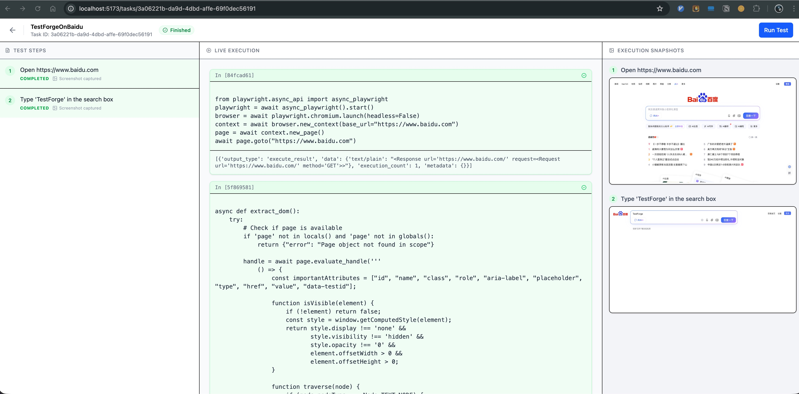

# TestForge

TestForge is an autonomous testing agent designed to simplify and automate end-to-end testing using modern tools like Playwright and Jupyter Kernels. It provides a web-based interface for managing test cases, executing them in real-time, and visualizing the results.

TestForge 是一个自动化测试 Agent，旨在利用 Playwright 和 Jupyter Kernel 等现代工具简化端到端测试。它提供了一个基于 Web 的界面，用于管理测试用例、实时执行测试并可视化结果。

> 🚀 **Vibe Coding Project**: This entire repository was built using [Trae](https://www.trae.cn/) powered by the **Gemini-3** model.
> 🚀 **Vibe Coding 项目**: 本项目完全基于 [Trae](https://www.trae.cn/) 和 **Gemini-3** 模型构建。



## Features / 功能特性

- **Autonomous Execution**: Runs test cases automatically using a Jupyter-based runtime kernel.
  - **自主执行**: 使用基于 Jupyter 的运行时内核自动运行测试用例。
- **Interactive UI**: Manage tasks, view execution logs, and monitor cell-by-cell execution progress.
  - **交互式 UI**: 管理任务、查看执行日志并监控逐个单元格的执行进度。
- **YAML-based Test Cases**: Define test scenarios in a simple, human-readable YAML format.
  - **基于 YAML 的测试用例**: 使用简单易读的 YAML 格式定义测试场景。
- **Real-time Feedback**: Live updates of execution status and logs via polling.
  - **实时反馈**: 通过轮询实时更新执行状态和日志。

## Core Concepts / 核心概念

### Agent Architecture / Agent 架构

TestForge leverages a hierarchical multi-agent architecture powered by **LangChain DeepAgents**:

- **ForgeAgent (Master Agent)**: The orchestrator responsible for breaking down high-level test cases (YAML steps) into executable goals. It manages the overall task lifecycle and delegates specific execution steps to sub-agents.
- **AutomationAgent (Sub-Agent)**: A specialized ReAct agent equipped with Playwright tools. It receives specific goals from the Master Agent and autonomously executes browser interactions.

TestForge 采用基于 **LangChain DeepAgents** 的分层多 Agent 架构：

- **ForgeAgent (Master Agent)**: 编排者，负责将高层测试用例（YAML 步骤）拆解为可执行的目标。它管理整体任务生命周期，并将具体执行步骤委派给子 Agent。
- **AutomationAgent (Sub-Agent)**: 配备 Playwright 工具的专用 ReAct Agent。它接收来自 Master Agent 的具体目标，并自主执行浏览器交互。

### Code-Driven Execution / 代码驱动执行模式

Unlike traditional keyword-driven or record-playback tools, TestForge operates on a **Code-Generation & Execution** paradigm:

- **Iterative Coding**: The Agent "thinks" in Python code. To achieve a test step (e.g., "Search for 'Playwright'"), it generates valid Playwright Python code on the fly.
- **Stateful Runtime**: This code is executed in a sandboxed Jupyter Kernel, allowing for stateful interactions and immediate feedback.
- **Self-Correction**: If an error occurs, the Agent analyzes the traceback, corrects its code, and retries, mimicking a human developer's workflow.

不同于传统的关键字驱动或录制回放工具，TestForge 采用 **代码生成与执行** 范式：

- **迭代式编程**: Agent 以 Python 代码的形式进行“思考”。为了实现测试步骤（例如“搜索 'Playwright'”），它会即时生成有效的 Playwright Python 代码。
- **有状态运行时**: 这些代码在沙箱化的 Jupyter Kernel 中执行，支持有状态的交互和即时反馈。
- **自我修正**: 如果发生错误，Agent 会分析回溯信息，修正代码并重试，模拟人类开发者的工作流。

## Architecture / 架构

- **Backend**: Python (FastAPI), Jupyter Client, Playwright
- **Frontend**: React, Vite, Tailwind CSS, TanStack Query
- **Runtime**: Custom Jupyter Kernel for executing Playwright code

## Getting Started / 快速开始

### Prerequisites / 前置要求

- Python 3.10+
- Node.js 18+
- [uv](https://github.com/astral-sh/uv) (Fast Python package installer and resolver)

### Installation / 安装

1.  **Clone the repository / 克隆仓库**

    ```bash
    git clone https://github.com/yourusername/TestForge.git
    cd TestForge
    ```

2.  **Install dependencies / 安装依赖**

    Use the provided Makefile to install both backend and frontend dependencies:
    使用提供的 Makefile 安装后端和前端依赖：

    ```bash
    make install
    ```

### Running the Application / 运行应用

1.  **Start the Backend API / 启动后端 API**

    Open a terminal and run:
    打开一个终端并运行：

    ```bash
    make start-api
    ```
    The API will be available at `http://localhost:8000`.
    API 将在 `http://localhost:8000` 上可用。

2.  **Start the Web UI / 启动前端 Web UI**

    Open another terminal and run:
    打开另一个终端并运行：

    ```bash
    make start-web
    ```
    The Web UI will be available at `http://localhost:5173`.
    Web UI 将在 `http://localhost:5173` 上可用。

### Development / 开发

- **Run Tests / 运行测试**: `make test`
- **Clean Environment / 清理环境**: `make clean`

## Project Structure / 项目结构

```
TestForge/
├── src/
│   └── forge/
│       ├── api/        # FastAPI backend implementation / 后端 API 实现
│       ├── runtime/    # Jupyter runtime & kernel logic / Jupyter 运行时和内核逻辑
│       └── agent/      # Agent logic (planned) / Agent 逻辑 (计划中)
├── tests/              # Unit and integration tests / 单元和集成测试
├── web/                # React frontend application / React 前端应用
├── pyproject.toml      # Python project configuration / Python 项目配置
└── Makefile            # Build and utility commands / 构建和实用命令
```

## License

MIT

## Project Statistics / 项目统计

This project is a testament to the efficiency of AI-assisted coding. Here is the code breakdown generated by `cloc`:
本项目见证了 AI 辅助编程的高效性。以下是由 `cloc` 生成的代码统计：

| Language | Files | Blank | Comment | Code |
| :--- | :--- | :--- | :--- | :--- |
| JSON | 6 | 4 | 0 | 4388 |
| Python | 26 | 355 | 432 | 1271 |
| TypeScript | 8 | 65 | 18 | 607 |
| Markdown | 3 | 56 | 0 | 151 |
| TOML | 1 | 3 | 0 | 31 |
| JavaScript | 1 | 1 | 0 | 22 |
| YAML | 1 | 5 | 0 | 22 |
| make | 1 | 6 | 3 | 14 |
| HTML | 1 | 0 | 0 | 13 |
| SVG | 2 | 0 | 0 | 2 |
| CSS | 1 | 0 | 0 | 1 |
| **SUM** | **51** | **495** | **453** | **6522** |

## Acknowledgements / 致谢

**100% of the code** in this project was written by AI.
**本项目 100% 的代码** 由 AI 编写。

Special thanks to:
- **[Trae](https://www.trae.cn/)**: The Real AI Engineer that made this project possible through its powerful SOLO mode and intelligent IDE features.
- **Gemini-3**: The underlying model providing the reasoning and coding capabilities.

特别感谢：
- **[Trae](https://www.trae.cn/)**: 真正的 AI 工程师，通过其强大的 SOLO 模式和智能 IDE 特性使本项目成为可能。
- **Gemini-3**: 提供推理和编程能力的底层模型。
